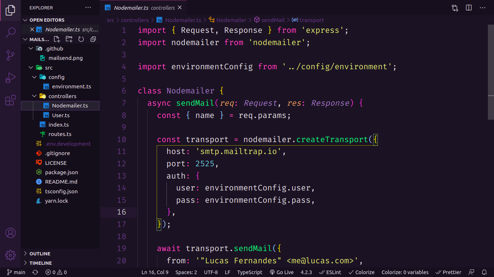

<p align="center">
  <h3 align="center">A simple mail send with nodemailer!</h3>

  <p align="center">
    A simple nodemailer API that sends a welcome email when a user is created.
    <br />
    <a href="https://github.com/lucfersan/simple-nodemailer-api"><strong>Explore the docs »</strong></a>
    <br />
    <br />
    ·
    <a href="https://github.com/lucfersan/simple-nodemailer-api/issues">Report Bug</a>
    ·
    <a href="https://github.com/lucfersan/simple-nodemailer-api/issues">Request Feature</a>
  </p>
</p>

## 📙 About The Project



I wanted to build an API that sends email when the user is created, then I built this simple one with nodemailer.

In this project, I tested the emails with mailtrap, this means this project is just a test with no production setup.

### 🛠️ Built With

- [Typescript](https://www.typescriptlang.org/)
- [Express](https://www.npmjs.com/package/express)
- [Nodemailer](https://nodemailer.com/about/)

### 🚀 Installation

1. Clone the repo
   ```sh
   git clone https://github.com/lucfersan/simple-nodemailer-api
   ```
2. Install NPM packages
   ```sh
   cd simple-nodemailer-api
   yarn
   ```
3. Add a .env.development file on the root of the folder
4. Change NODEMAILER_USER and NODEMAILER_PASS to your mailtrap credentials

## 🤝 Contributing

Contributions are what make the open source community such an amazing place to be learn, inspire, and create. Any contributions you make are **greatly appreciated**.

1. Fork the Project
2. Create your Feature Branch (`git checkout -b feature/AmazingFeature`)
3. Commit your Changes (`git commit -m 'Add some AmazingFeature'`)
4. Push to the Branch (`git push origin feature/AmazingFeature`)
5. Open a Pull Request

## 🗞️ License

Distributed under the MIT License. See `LICENSE` for more information.

## 📫 Contact

Lucas Fernandes - fernandes.lucas11@outlook.com

Project Link: [https://github.com/lucfersan/simple-nodemailer-api](https://github.com/lucfersan/simple-nodemailer-api)
